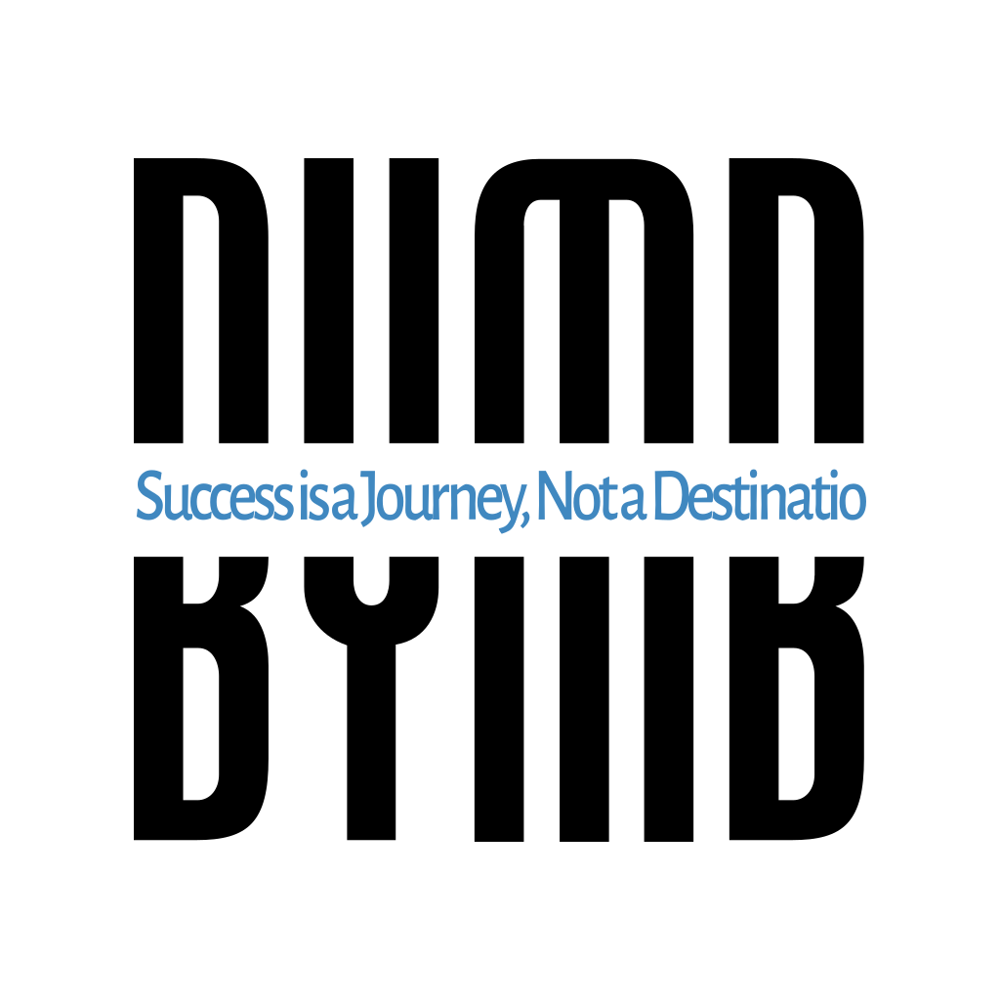

# BY MB Consultancy .

<p align="center">
  
</p>

<p align="center">
  <strong>Smart Solutions for Modern Living & Business</strong><br>
  <em>Success is a Journey, Not a Destination</em>
</p>

<p align="center">
  <a href="#about">About</a> •
  <a href="#services">Services</a> •
  <a href="#projects">Projects</a> •
  <a href="#contact">Contact</a>
</p>

## About

BY MB Consultancy is a forward-thinking technology solutions provider based in Manama, Bahrain. Founded in March 2023, we specialize in delivering cutting-edge technology solutions that enhance security, improve efficiency, and drive business success for both residential and commercial clients throughout Bahrain.

### What We Offer

- **Smart Solutions**: Advanced CCTV, home automation, and integrated security systemsb
- **Analytics & Business Intelligence**: Power BI, SQL solutions, and predictive analytics
- **Digital Transformation**: Network infrastructure, cloud migration, and process automation
- **Online Store**: Curated technology products for CCTV, networking, and smart home devices

## Services

### Smart Solutions 
Transform your home or business with integrated security and automation systems:
- Advanced CCTV & Security Systems (24/7 surveillance, night vision, remote monitoring)
- Home & Office Automation (lighting, climate, entertainment)
- Integrated Smart Ecosystems (centralized control, voice integration)

### Analytics & Business Intelligence 
Turn your data into strategic insights:
- Custom Power BI dashboards
- Database design and optimization
- Web scraping and ETL processes
- Predictive analytics and modeling

### Networking & Digital Transformation 
Build robust infrastructure and modernize operations:
- Enterprise networking solutions
- Digital transformation consulting
- Cloud solutions and migration
- Process automation

## Projects

This repository contains documentation and resources for BY MB Consultancy's projects:

```
├── company-profile/         # Official company profile documents
├── marketing/              # Marketing materials and templates
├── case-studies/          # Client success stories
├── presentations/         # Business presentations
├── products/              # Product specifications and pricelists
└── resources/             # Technical guides and FAQs
```

## Technology Stack

We leverage industry-leading technologies to deliver exceptional results:

- **Smart Home**: Home Assistant, ESPhome, Zigbee2Mqtt
- **Security**: Hikvision, EZVIZ
- **Analytics**: Power BI, SQL, Python
- **Business Solutions**: AI business Autommation, Odoo ERP, Cloud Platforms
- **Networking**: TP-Link, IP-COM

## Target Market

We serve clients throughout Bahrain, including:
- Homeowners seeking smart home solutions
- Small to medium businesses needing digital transformation
- Property developers incorporating advanced technologies
- IT-dependent organizations requiring end-to-end solutions

## Contributing

We welcome contributions from partners and collaborators. Please read our [CONTRIBUTING.md](CONTRIBUTING.md) for details on our code of conduct and the process for submitting pull requests.

## Contact

**Location**: Manama, Bahrain  
**Phone**: +973-66300033  
**Email**: info@by-mb.com  
**Website**: www.by-mb.com  
**Hours**: Sunday-Thursday, 9am-6pm  

### Connect With Us
[](https://www.linkedin.com/company/by-mb)
[](https://www.facebook.com/bymbcom)
[](https://www.instagram.com/bymbcom)

## License

© 2025 BY MB Consultancy. All Rights Reserved.

---

<p align="center">
  <strong>Empowering Better Living and Business Through Smart Technology</strong>
</p>
